## Digitaley-Bootcamp-2

## Introduction

This is a power Bi Boot Camp Capstone Project on the analysis of a global online retailer based in New York known as the **Global Superstore**
The capstone project is to analyze the Superstore and derive insights to answer questions and in order to increase performance and profitability.
**_Disclaimer_**: _Please note that all datasets and reports do not represent any company, institution or country, but just a dummy dataset to demostrate capabilities of Power BI._

## Problem statement
-1a. What are the three countries that generated the highest total profit for Global Superstore in 2014?

-1b. For each of these three countries, find the three products with the highest total profit. Specifically, what are the products’ names and the total profit for each product?

-2. Identify the 3 subcategories with the highest average shipping cost in the United States.

-3. Assess Nigeria’s profitability (i.e., total profit) for 2014. How does it compare to other African countries? b) What factors might be responsible for Nigeria’s poor performance? You might want to investigate shipping costs and the average discount as potential root causes.

-4a. Identify the product subcategory that is the least profitable in Southeast Asia. Note: For this question, assume that Southeast Asia comprises Cambodia, Indonesia, Malaysia, Myanmar (Burma), the Philippines, Singapore, Thailand, and Vietnam. b) Is there a specific country in Southeast Asia where Global Superstore should stop offering the subcategory identified in 4a?

-5. Which city is the least profitable (in terms of average profit) in the United States? For this analysis, discard the cities with less than 10 Orders. b) Why is this city’s average profit so low? 

-6. Which product subcategory has the highest average profit in Australia?

-7. Who are the most valuable customers and what do they purchase?

## Skills/Concepts demostrated:

The following Power BI Concepts applied:
- Power query,
- DAX concepts:Quick measure,
- Data modelling,
- Filters,
- Tooltips

## Modelling
DATA MODELLING
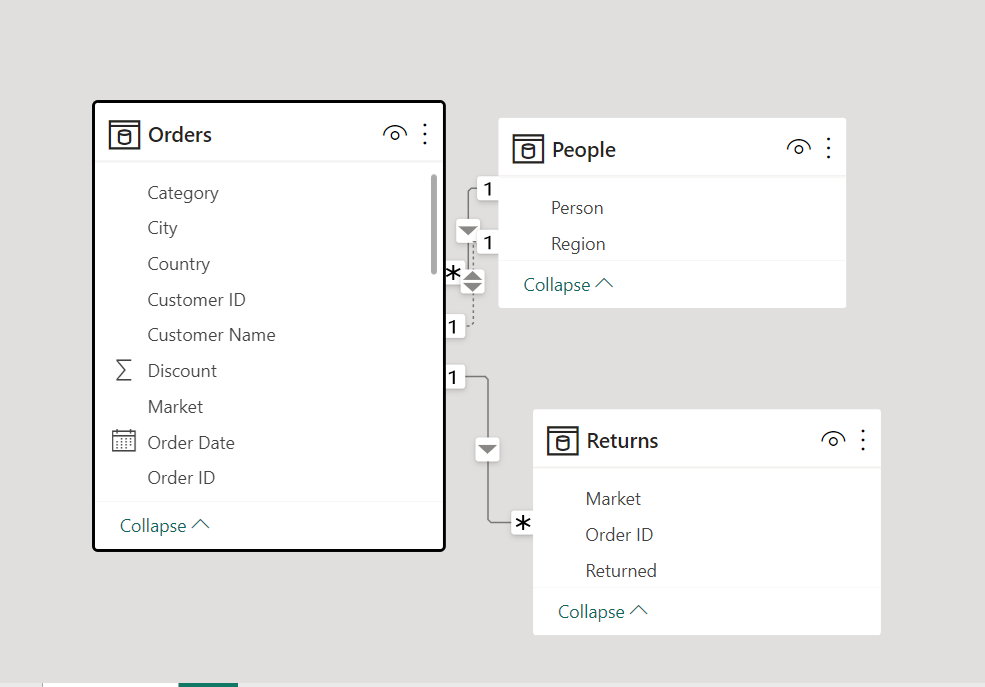

Power BI automatically detects related tables resulting in a star schema model connecting them using the Manage Relationship. The two tables; People and Return table are connected to the Order table via common columns; ‘Order ID and Region respectively.

## Visualization:

The report is just 1 page which provides answers and insights
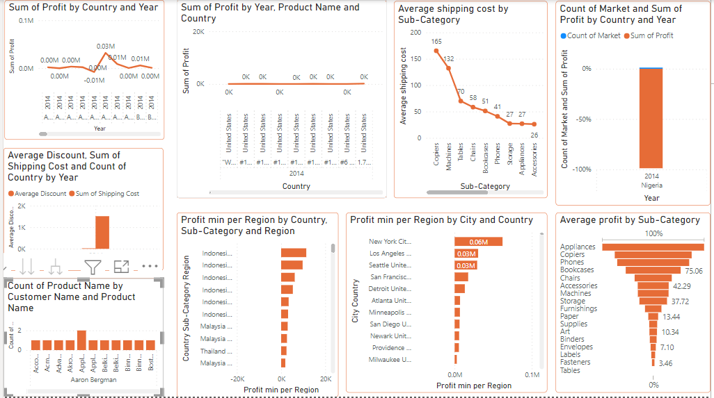
This is the picture of the dashboard

## Analysis:

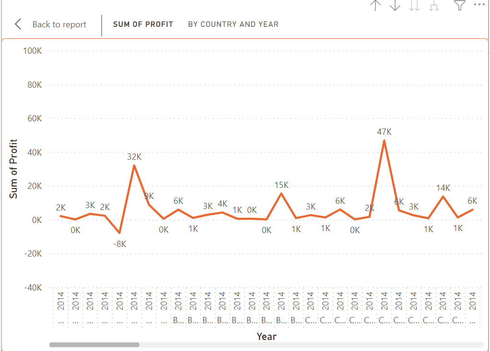
United states, India and China were the 3 countries that generated the highest total profit for the store in 2014 with 94k, 49k and 47k respectively.

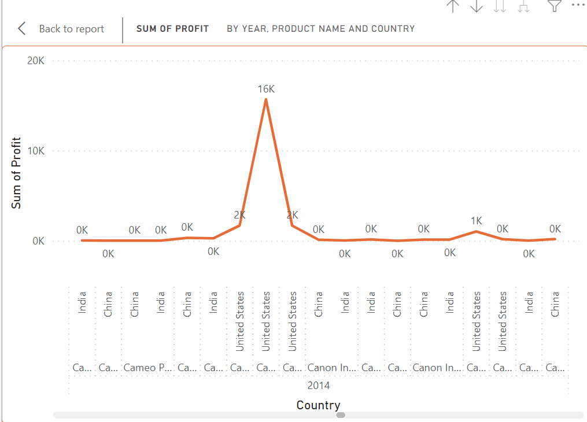
Canon image CLASS 2200 advanced copier, Canon image D680 copier/fax and Canon image CLASS D660 copier has the highest total profit

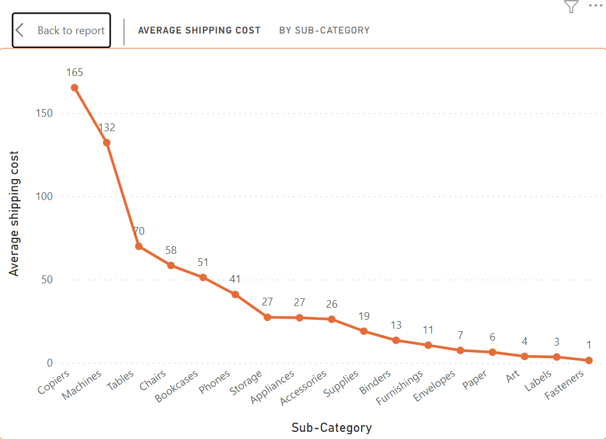
Copiers, Machine and Tables are the 3 sub-categories with the highest average shipping cost in the United states, having an average shipping cost of 165, 132 and 69 respectively.

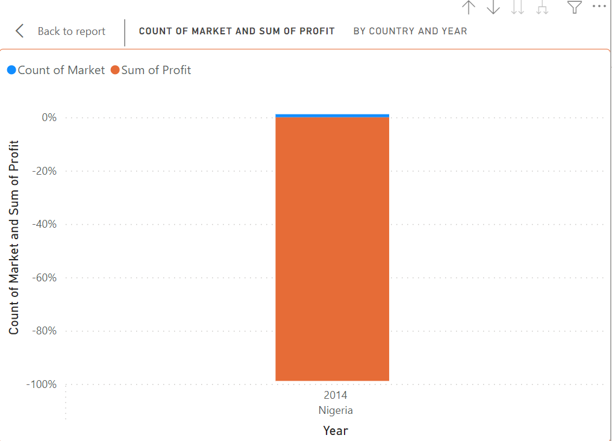
Assessing Nigeria's profitability for year 2014 with comparison with other African countries shows Nigeria's total profit is low compared to other African countries

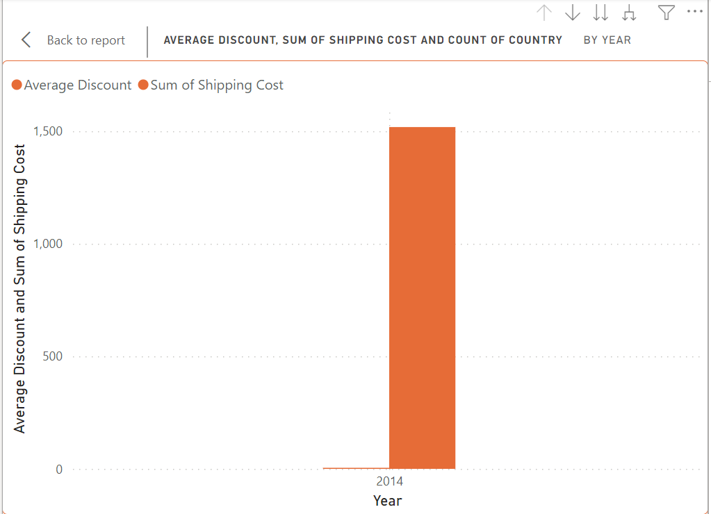
After analysing the data with shipping cost and avaerage discount as a potential cause shows that both shipping cost and average discount are both high indicating them as the root causes responsible for Nigeria's poor performance.

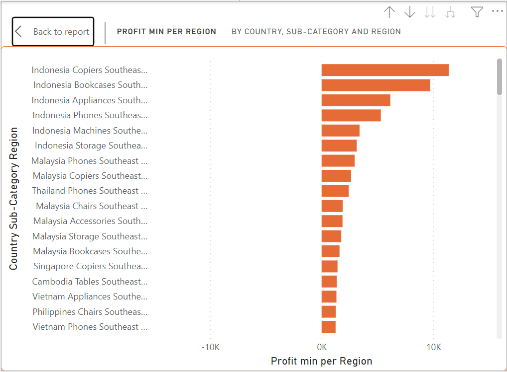
Phones are the product subcategories that is the least profitable in South East Asia and Global Superstore is advised stop offering Phones to Vietnam due to the low profit.

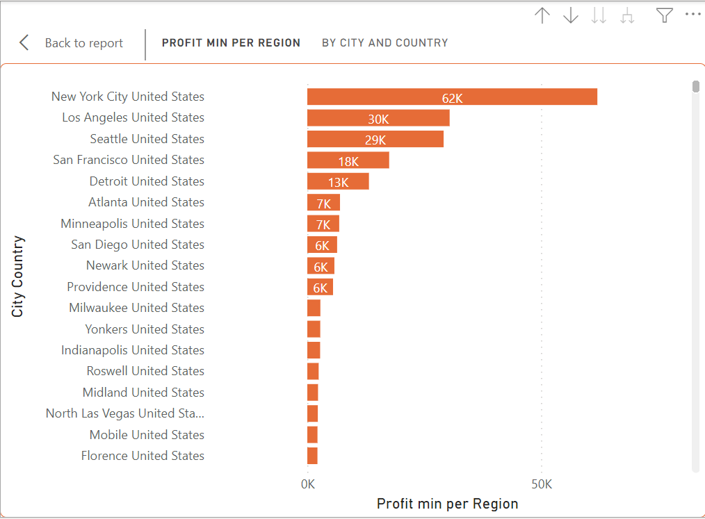
The city with the least profitable in the United states is Florence, having the lowest average profit

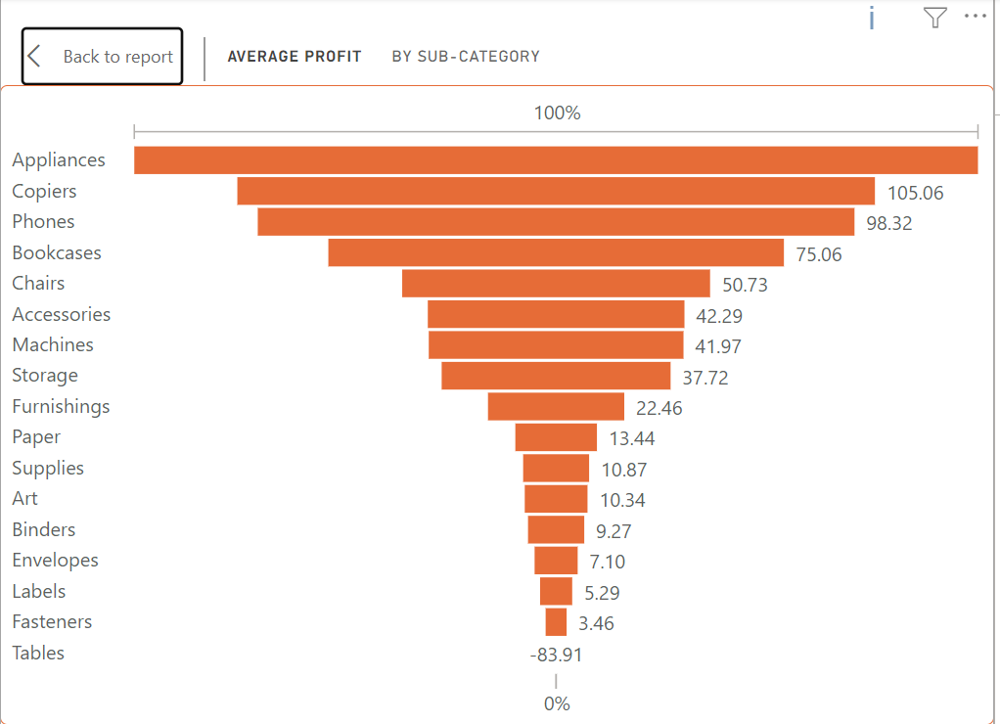
Appliances followed by Copiers are the product subcatergory that has the highest average profit in Australia.

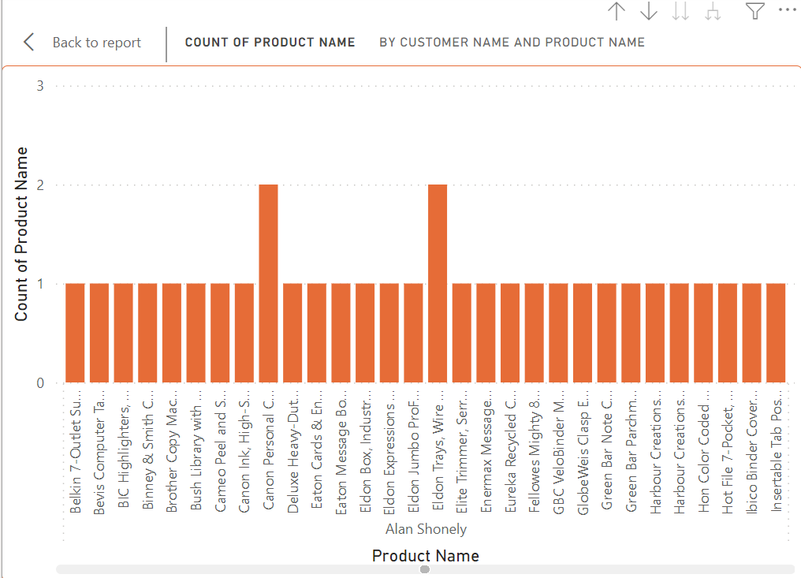
This shows the most valuable customers and what they purchase.

## Conclusion and Recommendation
More effort is needed to push the sales of Phones, binders, tables, labels and fasteners in a lot of countries outside United states and identify a better way to improve performance by reviewing the high shipping cost.

